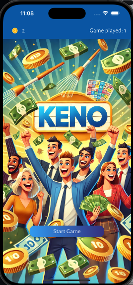

# KENO CODE CHALLENGE



## Objective:
To create a minimal version of the Keno live ball draw and ticket matching system.
This is meant to help us understand your programming styles and preferences, also the capability of implementing features and good code
structure.

* Full Description can be found here: assets/pdf/keno_challenge_doc.pdf

## How to Clone repository:
```bash
git clone git@github.com:Yaronkr/keno_code_challenge.git
cd keno_code_challenge
```

## How to Application:
```bash
flutter clean
flutter pub get
```

## Running the Application:
* Application can run on Chrome(Web), or Android/ ios simulator
```bash
Flutter run
```

## Run test
```bash
flutter test
```

## TODO:

1. Add about page
2. Add game rules page
3. Create more extensive tests
4. Add an option to choose the gambling amount

